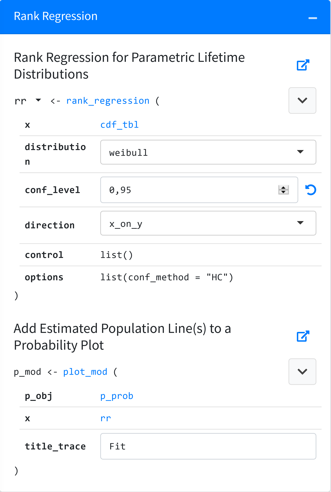
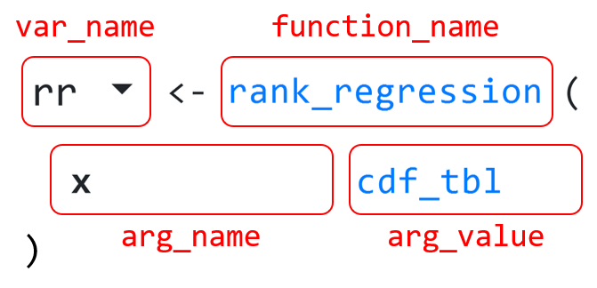
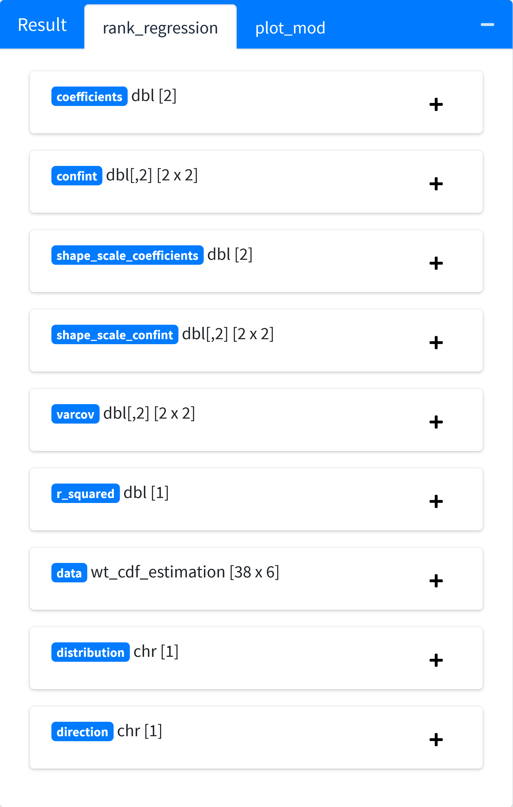
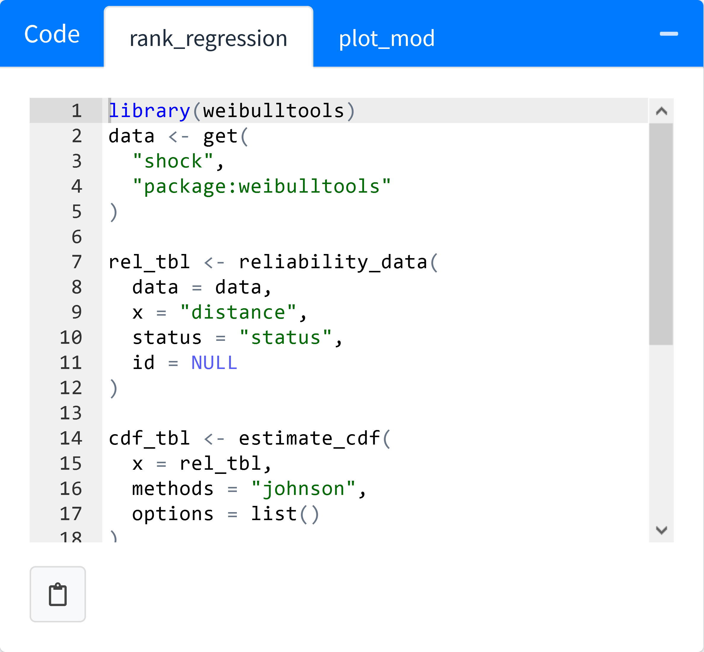

<!-- README.md is generated from README.Rmd. Please edit that file -->

# weibulltools-app

<!-- badges: start -->
<!-- badges: end -->

## Overview

The application consists of a *Getting Started* guide for a quick
walkthrough and several tabs which provide more detailed documentation.
The user interface of most tabs is divided in two columns.

The left column, which resembles one or more R function calls, is highly
interactive.

The following figure shows the components that form a function call.

-   Clicking on `var_name` opens a dropdown menu which contains links to
    all locations where this variable is used. Clicking a link switches
    to the required tab and highlights the function call.
-   Clicking on `function_name` opens the {pkgdown} page of the
    corresponding function in a modal dialog.
-   Hovering over `arg_name` displays the documentation of the argument
    (@param)
-   `arg_value` may be either the result (`var_name`) of a previous
    function call or a plain argument. In the former case clicking on
    `arg_value` jumps to the location where the `var_name` was defined.
    In the latter case it is up to the user to choose a value using a
    `selectInput` or `numericInput`.

The right column consists of a code box and a result box. The code box
displays the live code which can be used to reproduce the results in an
R session. Note that you must have installed the GitHub version of
{weibulltools}. The result box displays the result that you get by
executing the code of the code box in a user-friendly manner. The user
interface depends on the class of the result (table, list or plot). The
user interface of a list is recursive, so that nested lists are
displayed properly. Code box and result box contain one tab per function
call in the left column. Corresponding tabs are connected so that code
box and result box always display information regarding the same
function call.

## Implementation Details

### {pkgdown} crawling

The {pkgdown} website of {weibulltools} was downloaded and modified
using {xml2}. For example, relative links had to be replaced by absolute
links, so that clicking a link in the application leads to a valid
{pkgdown} page. {xml2} is further used to extract required information
from the html source like the documentation text of each argument or the
title of each function.

### Code-generation with {shinymeta}

{shinymeta} is an experimental package providing tools for capturing
logic in a Shiny app and exposing it as code. It introduces
`metaReactives`, that not only capture results like usual `reactives`
but as well make the code that was used to generate this result
accessible. The resulting code is formatted by {styler} and displayed by
{shinyAce}.

### Lazy-loading of server functions

When the application starts all modules’ server functions are called
once. This may give an initial impression to the user that the
application is slow when in fact it is not. As this application contains
many tabs, it is sufficient to guarantee that only the active tab has
been initialized, which is ensured by the logic implemented in
[container.R](https://github.com/DavidBarke/weibulltools-app/blob/main/modules/container.R),
which also handles dependencies between tabs.

### Quick fixes

By default, errors in Shiny’s render functions are caught, and a generic
message is displayed to the user. Whereas this behavior is desirable
when errors occur due to faulty implementation, it is better to display
the actual error messages to the user when presenting functions of a
package. However, the inexperienced application user might not know how
to recover from an error. Therefore, quick fix buttons were added, that
help the user to recover from the most common errors in {weibulltools},
for example, selecting different distributions for the probability plot
and the estimated model.

### Miscellaneous

-   The dark mode is controlled using a cookie so that the initial state
    of the dark mode toggle is determined by your previous selection
-   Function calls can be collapsed so that arguments are displayed in a
    shorter, non-interactive manner

## {weibulltools}

{weibulltools} focuses on statistical methods and visualizations often
used in reliability engineering including the Weibull analysis and Monte
Carlo simulations. The *Getting Started* guide in the application and
the vignettes of the {pkgdown} documentation page are great for getting
an overview of the package. By providing diverse results as tables,
lists and plots, {weibulltools} is especially well-suited to be
presented by a Shiny application. The fact that many functions generate
results that can be piped to other functions provides unique
opportunities for referencing and navigation throughout the application.

-   Source code of {weibulltools}:
    <https://github.com/Tim-TU/weibulltools>
-   {pkdown} documentation page:
    <https://tim-tu.github.io/weibulltools/>
-   Source code of application:
    <https://github.com/DavidBarke/weibulltools-app>
-   Live version of application: <https://weibulltools.org>
